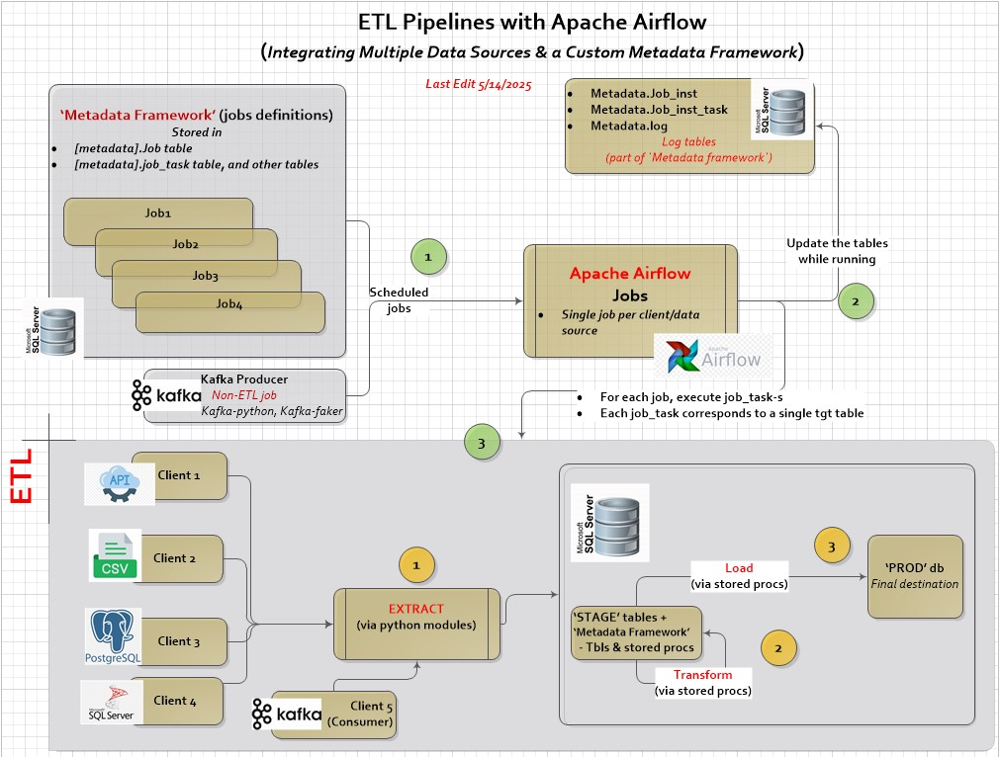
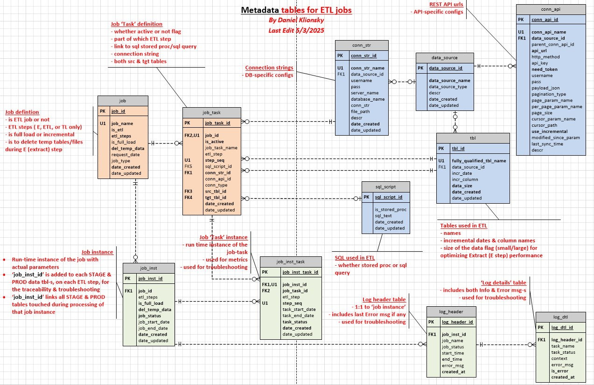
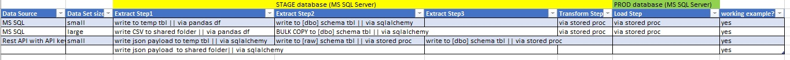
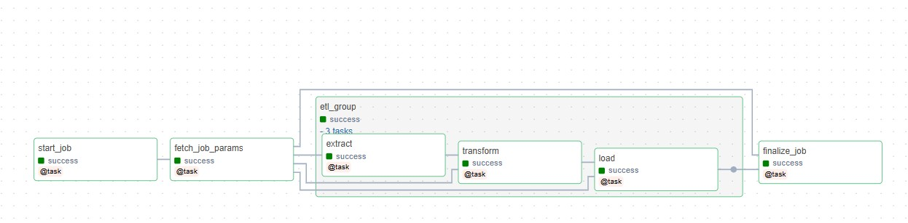

# ETL Metadata Framework for managing complex data workflows in Apache Airflow:
---
## Main Features

- Contains stand-alone fully functional set of metadata tables, and stored procs for ETL support.
- Extracts sample data from various data sources (flat files, RDBMS, REST API) with emphasis on performance.
- Loads and transforms data using SQL stored procs
- Scheduled via Airflow

---

## Tech Stack

- **Apache Airflow**
- **Python**
- **MS SQL Server**
- **Docker** 

---

## Project Notes

- MS SQL server, installed on a separate machine, is a destination that contains 
  1. ETL metadata tables (metadata `schema`)
  2. Both `Stage` & `Prod` data tables.
- Apache Airflow, installed on Docker, is used for scheduling & ETL processing.
- Extract part is done via python modules.
- Both Transform & Load steps are implemented via stored procedures.
  
### Project Architecture: 
 

---

## ETL-Metadata-tables Features

The set of ETL meatadata tables, the 'brain' of the system, includes job & job tasks definitions, clients/data sources configurations as well as logs.
It provides support for 
- Full/incremental extracts based on incremental dates.
- Data Lineage.
- E (Extract) only, or TL (Transform & Load) only jobs.
- Storage of Extract sql queries as well as tracking of stored procs (aka 'scripts') used in Transform & Load steps.
- 'Large' and 'Small' client data sets/data sources resulting  in the different approaches for performance.
- Making specific job tasks active/inactive without affecting the job or other job tasks for that job.
- On/off fuctionality for deletion of the temp data structures during Extract step, which is helpfull during debugging/research.
- Full logging (in addition to Apache Airlfow logging).

### ETL-Metadata-tables schema 
 

### Covered Use cases:
 

### AirFlow graph:
 

---

## Road Map

- Add Use cases for streaming data (Kafka), Parque files (AWS)
- Add support for PostgresSQL metadata store (currently, MS SQL Server only)

