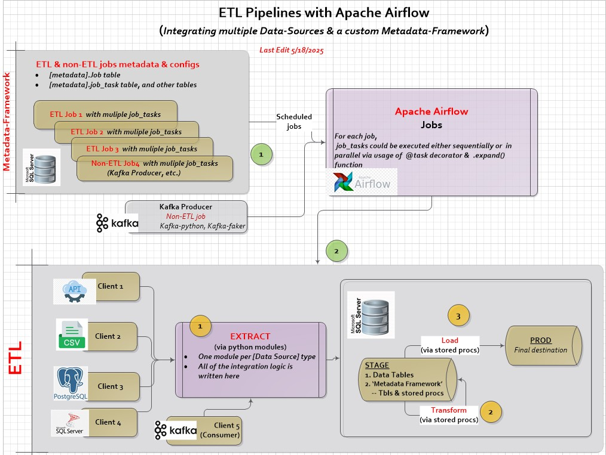

# Complete ETL solution with metastore, pipelines, and Apache Airflow

---
## Main Features

- Contains stand-alone fully functional set of metadata tables, and stored procs for ETL.
- Extracts sample data from various data sources (flat files, RDBMS, REST API)
- Loads and transforms data using SQL stored procs
- Scheduled via Airflow

---

## Tech Stack

- **Apache Airflow**
- **Python**
- **MS SQL Server**
- **Docker** 

---

## Project Notes

- MS SQL server, installed on a separate machine, is a destination that contains 
  1. ETL metadata tables (metadata `schema`)
  2. Both `Stage` & `Prod` data tables.
- Apache Airflow, installed on Docker, is used for scheduling & ETL processing.
- Extract part is done via python modules.
- Both Transform & Load steps are implemented via stored procedures.
  
### Project Architecture: 
 

  Meatadata tables for ETL jobs. This is a 'brain' of the system.
 Metadata tables contain job & job tasks definitions, clients/data sources configurations as well as logs.
 

 
Covered ETL Use cases:
 

  
AirFlow graph:
 

