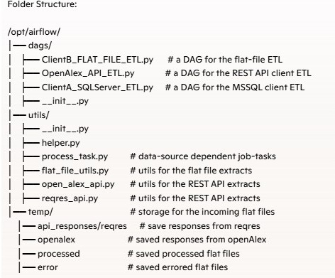

# Metadata-Driven ETL Framework for Complex Workflows in Apache Airflow

---

## About

This framework provides a metadata-driven orchestration layer integrated with Apache Airflow, enabling scalable, maintainable, and auditable ETL processes. It abstracts job definitions, task logic, source configurations, and execution states into centralized metadata tables, forming the "brain" of the system.

## ✅ Main Features

- Contains a fully functional, stand-alone set of metadata tables, stored procedures, and python modules to support ETL processes.
- Extracts sample data from various data sources—flat files, relational databases (RDBMS), and REST APIs(token-based auth, pagination, etc.)—with a strong emphasis on performance.
- Scheduled and orchestrated through Apache Airflow.

---

## Tech Stack

- **Apache Airflow**
- **Python**
- **MS SQL Server**
- **Docker** 

---

## Project Notes

- Microsoft SQL Server, installed on a separate machine, serves as the destination database and contains:
  1. ETL metadata tables (in a dedicated metadata schema)
  2. Both staging and production data tables
- Apache Airflow, running in Docker, is used for job scheduling and ETL orchestration.
- The Extract step is implemented using Python pandas, sqlalchemy and SQL Server stored procs.
- The Transform and Load steps are handled via SQL stored procedures.
  
### Project Architecture: 

### Project Structure: 

---

## 🧠 ETL-Metadata-framework Database Features

ETL meatadata tables include job & job tasks definitions, clients/data sources configurations as well as logs.
They provide support for 
- Full and Incremental `Extracts` based on incremental dates.
- `Data Lineage` & Traceability (source systems, intermediate steps, and target destinations).
- `Extract`-only or (`Transform` & `Load`)-only job structures.
- Storage of `Extract` sql queries as well as the tracking of the stored procs (aka 'scripts') used in `Transform` & `Load`.
- `Large vs. Small Data Strategies` resulting in the different approaches for performance.
- Task-level activation on/off-switches without modifying the overall job
- Configurable cleanup for the temp structures (staging tables, flat files) via metadata on/off-switches; helpful for debugging and research.
- Full logging (in addition to Apache Airlfow logging).

### ETL-Metadata-tables schema 
 

### Covered Use cases:
 

### AirFlow graph:
 

---

## Road Map

- Add Use cases for streaming data (Kafka), Parque files (AWS)
- Add support for PostgreSQL metadata store (currently, MS SQL Server only)

