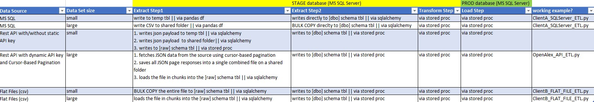

# ETL Metadata Framework for managing complex data workflows in Apache Airflow

---

## About

This framework provides a metadata-driven orchestration layer integrated with Apache Airflow, enabling scalable, maintainable, and auditable ETL processes. It abstracts job definitions, task logic, source configurations, and execution states into centralized metadata tables, forming the "brain" of the system.

## Main Features

- Contains a fully functional, stand-alone set of metadata tables and stored procedures to support ETL processes.
- Extracts sample data from various data sources—flat files, relational databases (RDBMS), and REST APIs—with a strong emphasis on performance.
- Performs data loading and transformation via SQL stored procedures
- Scheduled and orchestrated through Apache Airflow.

---

## Tech Stack

- **Apache Airflow**
- **Python**
- **MS SQL Server**
- **Docker** 

---

## Project Notes

- MS SQL server, installed on a separate machine, is a destination that contains 
  1. ETL metadata tables (metadata `schema`)
  2. Both `Stage` & `Prod` data tables.
- Apache Airflow, installed on Docker, is used for scheduling & ETL processing.
- Extract part is done via python modules.
- Both Transform & Load steps are implemented via stored procedures.
  
### Project Architecture: 
 

---

## 🧠 ETL-Metadata-framework Database Features

ETL meatadata tables include job & job tasks definitions, clients/data sources configurations as well as logs.
They provide support for 
- Full and Incremental `Extracts` based on incremental dates.
- `Data Lineage` & Traceability (source systems, intermediate steps, and target destinations).
- `Extract`-only or (`Transform` & `Load`)-only job structures.
- Storage of `Extract` sql queries as well as the tracking of the stored procs (aka 'scripts') used in `Transform` & `Load`.
- `Large vs. Small Data Strategies` resulting in the different approaches for performance.
- Task-level activation on/off-switches without modifying the overall job
- Configurable cleanup for the temp structures (staging tables, flat files) via metadata on/off-switches; helpful for debugging and research.
- Full logging (in addition to Apache Airlfow logging).

### ETL-Metadata-tables schema 
 

### Covered Use cases:
 

### AirFlow graph:
 

---

## Road Map

- Add Use cases for streaming data (Kafka), Parque files (AWS)
- Add support for PostgresSQL metadata store (currently, MS SQL Server only)

